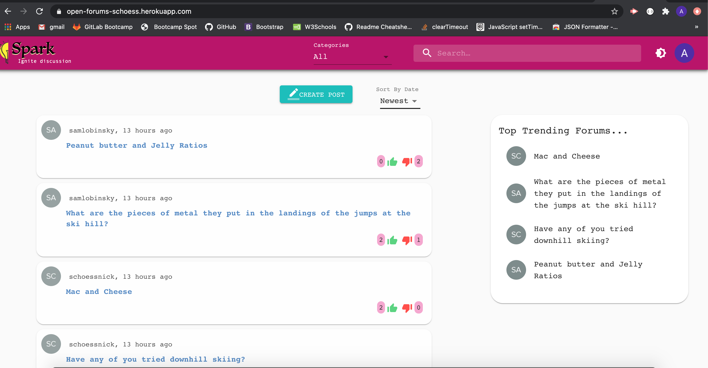
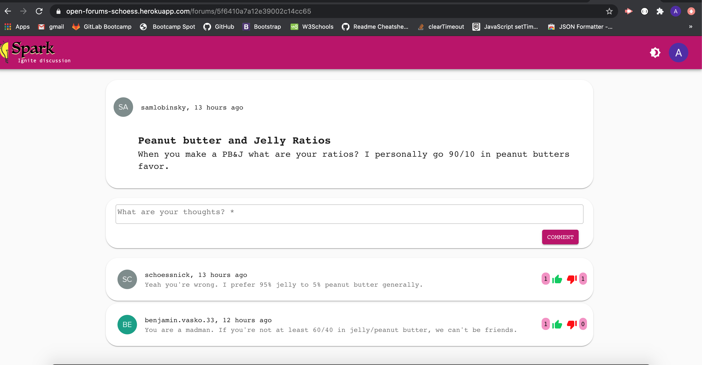
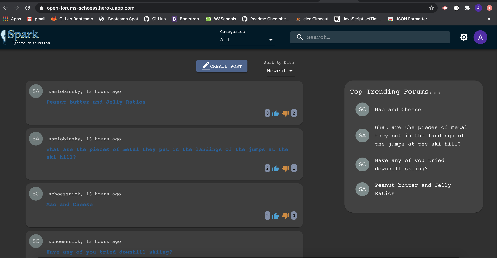

# Open_Forums(Spark Ignite Discussion)
Spark Ignite Discussion is what it claims. A forum dedicated only to what it's users want.

### User Story
* As a forum user, I want to discuss the things I like and want to online, So that I can learn more about the people and happenings in our world. So We wanted to create an easy and fun way to build communities without the need to participate in other major social network platforms
#### Table of Contents
* [Description](#description)
* [Take a Look](#take-a-look)
* [Installation](#installation)
* [Usage](#usage)
* [Technologies Used](#technologies-used)
* [License](#license)
* [Contributors](#contributors)
#### Description
* Given I am looking for an open forum, When I navigate to the Spark home page 
* Then I am met with a body of posts from various users covering various topics
* When I examine the page, Then I can see what each post says
* When I  click login/register, Then I can register or login to an existing account
* When I login, Then I can either delete posts I’ve made, make a new post, like/dislike existing posts, or comment on existing posts
* When I create a post, I can select for a category from the drop down to create a thread.
* Latest post should post on the top.
* When clicking on the forum title, it will take you to another page to give comments to that specific thread
* Search option to search for a specific posts
* Set the page in light and dark mode , so we can see the page in two modes whichever we want 
* When clicking the My forum button , it will display the list of threads created by that user 

#### Take a Look

Open_Forums: [Spark Ignite Discussion!](https://spark-forums.herokuapp.com/)

#### Installation
Steps to create the react app

`npx create-react-app <your react app name>` 

`cd <your app name>`

`npm start`

Steps to install the dependencies

`npm i`

#### Dependencies
* @auth0/auth0-react
* @material-ui/core
* @material-ui/icons
* axios
* dotenv
* express
* if-env
* mongoose
* react-router-dom
* lodash
* moment

Note: They already included in npm package.json

####  Usage
* `git clone git@github.com:schoess/Open_Forums.git`
* `cd Open_Forums`
* Open Open_Forums folder in Command Line Terminal then run command `npm start`
* Runs the app in the development mode. 
* Open [http://localhost:3000](http://localhost:3000) to view it in the browser.
* The page will reload if you make edits. 

#### Technologies Used
This application is built with React framework and Material UI for the front end.

The back end uses Node.js and Express.js, backed by a Mongo Atlas with a Mongoose ODM.

* [Node.js](https://nodejs.org/en/) - JavaScript runtime
* [Express.js](https://expressjs.com/) - Lightweight web application framework for Node.js
* [Mongo Atlas](https://www.mongodb.com/cloud/atlas) - MongoDB Atlas is the global cloud database service for modern applications.
* [Mongoose](https://mongoosejs.com/) - Elegant mongodb object modeling for node.js

##### Authentication 
* OAuth 1.0 is the industry-standard protocol for authorization

##### Additional Technologies used are:

* [lodash](https://lodash.com/) - JavaScript Library that provides utility functions -- used for Object Mapping in this app
* [Material UI](https://material-ui.com/) - React component for building design 
* [dotenv](https://www.npmjs.com/package/dotenv)- Dotenv is a zero-dependency module that loads environment variables from a .env file into process.env

#### License
* This program is licensed under the [MIT](https://choosealicense.com/licenses/mit/) license.
#### Contributors
- [Anitha Venkatesan](https://github.com/Anitha-Venkatesan)
- [Benjamin Vasko](https://github.com/TribeOfBenjamin)
- [Nick Schoess](https://github.com/schoess)
- [Sathya Guru](https://github.com/karpagasathya)

